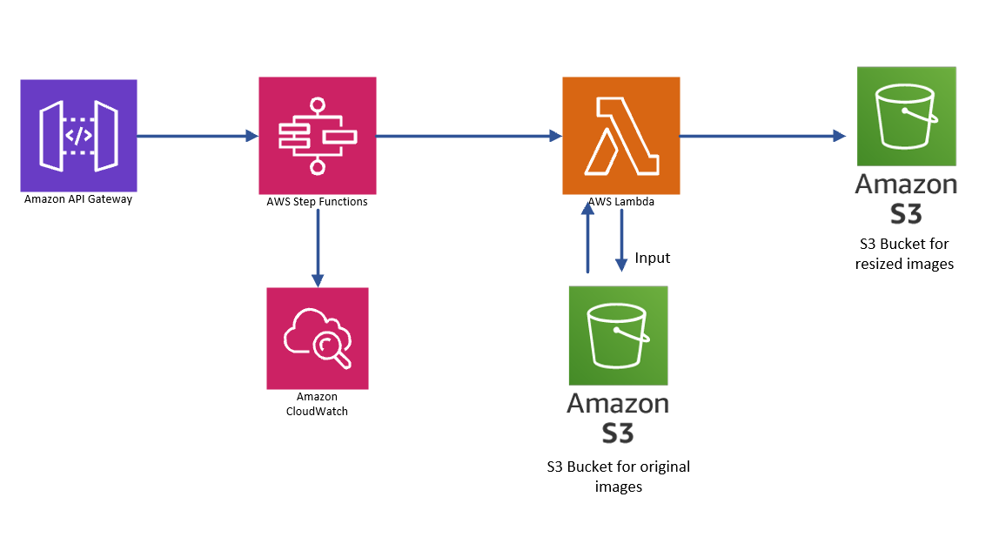

## Overview
+ This project implements a serverless image-processing pipeline on AWS.
+ When an API request is made through API Gateway, a Step Functions State Machine is triggered.
+ The state machine invokes a Lambda function using Python that:
 1. Downloads an image from an S3 source bucket
 2. Resizes it to a maximum of 720×720 pixels
 3. Saves the resized image into a destination S3 bucket
This creates a scalable, event-driven system for image processing without managing servers.

## Architecture Diagram

## 🧰 Prerequisites
Before deploying or testing this project, ensure you have:
 1. AWS Account with access to S3, Lambda, Step Functions, and API Gateway
 2. Python 3.x (for Lambda function)
 3. Pillow library installed via Lambda Layer:
    + Go to KLayers GitHub [https://github.com/keithrozario/Klayers/tree/master/deployments]
    + Select your Python version
    + Open the corresponding HTML file
    + Copy the ARN of the Pillow layer
    + In the Lambda console, go to your function → Add Layer → Provide Layer Version ARN
 4. Proper IAM roles and permissions set up so services can communicate (Lambda can access S3, Step Functions can invoke Lambda, API Gateway can start Step Functions, etc.)

⚠️ You may encounter the need to configure IAM roles during setup to allow secure service-to-service communication.

## 🚀 Deployment Instructions
1️⃣ Create S3 Buckets
  + Source bucket (original images): your-original-images-bucket
  + Destination bucket (resized images): your-resized-images-bucket

2️⃣ Go to the AWS Lambda Console and create a new function (or open your existing one).
   1. Upload your Python file (resize_image.py) directly. You can either:

     + Copy-paste the code in the inline editor
     
     + Upload it as a .zip containing only your Python file.
   2. Add the Pillow Lambda layer as described in the Prerequisites
   3. Set the environment variable for the destination bucket:
     Key: DESTINATION_BUCKET	 Value: your-resized-images-bucket
   4. Save the Lambda function.

3️⃣ Deploy Step Functions State Machine
   + Use the ASL definition in /StateMachine/ImageResizer.json
   + Assign Lambda execution role and permissions
   + Example ARN (replace with your actual ARN after creation):
      arn:aws:states:region:account-id:stateMachine:ImageResizeStateMachine

4️⃣ Configure API Gateway to trigger Step Functions
  1. Go to API Gateway -> APIs, Choose REST API and select import
  2. After importing `API_Gateway/api-definition.json`, go to:
   `API Gateway → Your API → Resources → /resize → POST Integration Request`
  3. Set **Integration type** to **AWS Service**  
   - AWS Region: `ca-central-1`   #or whatever region you want
   - AWS Service: `Step Functions`  
   - HTTP Method: `POST`  
   - Action Type: `Use action name` → Action Name: `StartExecution`  
   - Execution Role: `APIGatewayTriggerSFRole`  #The IAM you created to allow APIGateway to trigger State Machine
  4. Add a **mapping template** (Content-Type: `application/json`) using this template:

        #set($body = $input.json('$'))
        {
        "stateMachineArn": "[your state machine ARN ]",
        "input": "$util.escapeJavaScript($util.toJson($body))"
        }
  5. Deploy the API to a stage (prod):
    Go to Actions → Deploy API → Deployment Stage: prod
    This will give you the Invoke URL for the endpoint.

5️⃣ Test the Workflow
  ### Once deployed, you can test the /resize endpoint:
  1. Invoke URL placeholder: [https://<your-api-id>.execute-api.<region>.amazonaws.com/prod/resize] #Go to `API Gateway → Your API → Dashboard → Invoke URL`
  2. Headers: Content-Type: application/json
  3. Body:
        {
        "bucket": "bucket-original-image", #Name of the source bucket
        "key": "test.jpg" #Name of the target image you uploaded to the source bucket
        }

    Example using cURL:
    curl -X POST https://<your-api-id>.execute-api.<region>.amazonaws.com/prod/resize \
        -H "Content-Type: application/json" \
        -d '{
            "bucket": "bucket-original-image",
            "key": "test.jpg"
            }'
   4. Expected Response:
    {
    "executionArn": 
    "startDate": }

   ### 📜 Lambda Function Summary
        Receives bucket and key from Step Functions
        Reads original image from S3
        Resizes to max 720x720 keeping aspect ratio
        Saves resized image to destination bucket with prefix resized-
        Returns status and image_key
   ### 🧪 Testing
        Upload a .jpg or .png image to the source bucket
        Trigger Step Functions via API Gateway
        Check that the resized image is in the destination bucket
        Monitor CloudWatch logs for execution details